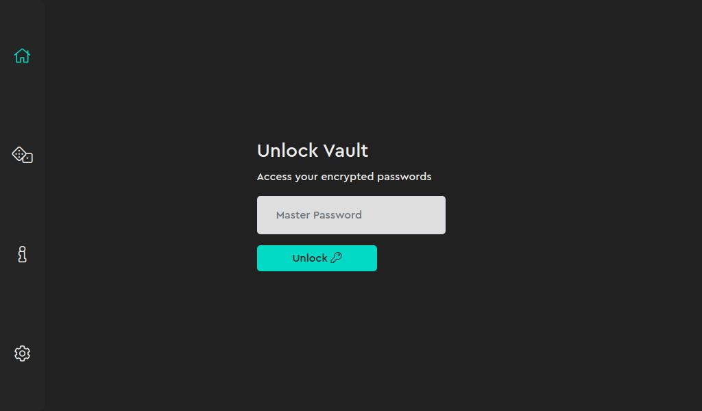

# Django Password Manager

A Password Manager built with Vue.js and Django.

<!-- ### Screenshots


 -->
### Installation and Usage

Open cmd in the projects directory (cmd/control + Shift) and type:

```
pip install -r requirements.txt
python manage.py runserver

```
